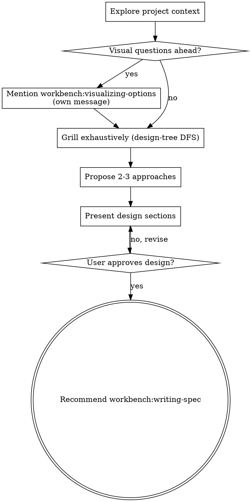

# Brainstorming Ideas Into Designs

Help turn ideas into well-formed designs through natural collaborative dialogue.

Start by understanding the current project context, then ask questions one at a time to refine the idea. Once the design is clear and the user approves, hand off to `workbench:writing-spec`.

<HARD-GATE>
Do NOT invoke any implementation skill, write any code, scaffold any project, or take any implementation action until you have presented a design and the user has approved it. This applies to EVERY project regardless of perceived simplicity.
</HARD-GATE>

## Anti-Pattern: "This Is Too Simple To Need A Design"

Every project goes through this process. A todo list, a single-function utility, a config change: all of them. Simple projects are where unexamined assumptions cause the most wasted work. The design can be short (a few sentences for truly simple projects), but you MUST present it and get approval.

## Checklist

You MUST create a task for each of these items and complete them in order:

1. **Explore project context**: dispatch a cost-efficient subagent to survey files, docs, and recent commits; use its summary as starting context.
2. **Offer visualizing-options** (if the topic will involve visual questions): mention `workbench:visualizing-options` in its own message; the user opts in.
3. **Grill exhaustively until a shared design concept emerges**: walk the design tree depth-first, resolving each branch's dependencies before moving to the next.
4. **Propose 2-3 approaches**: with trade-offs and your recommendation.
5. **Present design**: in sections scaled to their complexity, get user approval after each section.
6. **Recommend `workbench:writing-spec`** as the terminal step. That skill writes the spec doc, runs self-review, and gates on user approval.

## Grilling toward a shared design concept

Two minds building together share an invisible theory of the system: the design concept (Brooks, *The Design of Design*). The conversation surfaces it, questions strip away ambiguity, and the artifact at the end is a record of the conversation, not its purpose.

**Walk the design tree depth-first.**

Treat the design as a tree. The root is "what are we building, and why." Branches resolve to dependent decisions: which approach, which boundaries, which interfaces, which failure modes. Leaves are the decisions themselves. Pick one branch, follow every dependency to a decision, only then return to the next branch. Do not breadth-first a checklist of section headings.

**Take an adversarial posture.**

Probe for unstated assumptions, latent constraints, and edge cases the user has not considered. When the user gives a short answer, ask the obvious next question even when the answer feels implied. Treat the user as the source of truth about what they want and treat yourself as the source of skeptical pressure on whether they have said it clearly.

**Stop only when both are true:**

1. You cannot think of a question whose answer would change the design.
2. The user can re-state the design concept back to you in their own words.

Do not stop at "I have enough to write a spec." A numeric question minimum is not the rule; depth and convergence are.

**Scale to scope.**

The Anti-Pattern carve-out still applies. A one-line config change might converge in three questions. A new subsystem will not. Trust the design tree to tell you when there is more to ask. In autonomous runs where the user is not present (for example inside `workbench:autopilot`), substitute the second stop-rule clause with "the self-answered Q&A converges on a `## Decision` block whose design concept covers every branch you walked."

## Process Flow

## The Process

**Understanding the idea:**

- Delegate project-state exploration to a cost-efficient subagent (Claude Code: `Explore` agent type, haiku model. Codex: read-only research agent equivalent.) Pass a tight prompt: "Survey this repo. Report under 250 words: primary language, top-level structure, recent commits (last 5), presence of CLAUDE.md/AGENTS.md/README, any docs/ directory worth reading. Don't list every file." Use the returned summary as your starting context.
- Before asking detailed questions, assess scope: if the request describes multiple independent subsystems, flag this immediately. Do not spend questions refining details of a project that needs to be decomposed first.
- If the project is too large for a single spec, help the user decompose into sub-projects. Each sub-project then gets its own brainstorm and spec cycle.
- For appropriately scoped projects, ask questions one at a time.
- Prefer multiple choice questions when possible.
- One question per message.
- Focus on understanding: purpose, constraints, success criteria.
- See **Grilling toward a shared design concept** above for the depth-first design-tree protocol; the rules in this list are the mechanical rhythm.

**Exploring approaches:**

- Propose 2-3 different approaches with trade-offs.
- Lead with your recommendation and explain why.

**Presenting the design:**

- Scale each section to its complexity.
- Ask after each section whether it looks right so far.
- Cover: architecture, components, data flow, error handling, testing.
- Be ready to clarify if something does not make sense.

**Design for isolation and clarity:**

- Break the system into smaller units, each with one clear purpose, communicating through well-defined interfaces.
- Smaller, well-bounded units are easier to reason about. When a file grows large, that is often a signal it is doing too much.

**Working in existing codebases:**

- Delegate exploration of the area you are touching to a cost-efficient subagent. Follow the returned conventions.
- Where existing code has problems that affect the work, include targeted improvements as part of the design.
- Do not propose unrelated refactoring.

## Visual Questions

If the conversation will involve visual content (mockups, layouts, diagrams), mention `workbench:visualizing-options` in its own message before asking the next question. The user opts in by acknowledging. That skill owns the browser companion; this skill stays in the terminal.

The offer message should contain ONLY the pointer; do not combine it with clarifying questions.

## Handoff

Once the user has approved the design, your terminal action is to recommend `workbench:writing-spec`. Do NOT invoke any implementation skill, do NOT write the spec yourself, and do NOT proceed to planning. The spec writing skill takes over from there, runs its self-review, and gates on user approval before handing off to `workbench:writing-plans`.

The conversation itself is the handoff payload; the summary file is a record, not the interface between skills.

## Key Principles

- One question at a time.
- Multiple choice preferred.
- Depth-first grilling: walk the design tree, do not breadth-first a checklist.
- YAGNI ruthlessly.
- Explore alternatives.
- Incremental validation.
- Be flexible: go back and clarify when something does not make sense.

## Output Format

Default for this artifact: **html**.

Override resolution order, highest precedence first:

1. Per-invocation override in the user prompt. Recognize phrases like `"a markdown brainstorm summary"`, `"in HTML"`, `"as a markdown summary"`, and equivalents.
2. `.workbench/config.md` `## Output formats` entry for `Brainstorm summaries:`. Schema documented in `plugins/workbench/skills/autopilot/references/config-schema.md`.
3. Per-skill hard-coded default (html).

Path: `.workbench/brainstorms/YYYY-MM-DD-<topic>-brainstorm.<ext>` by default, where `<ext>` resolves from format. Override path via `.workbench/config.md` `## Output paths` `Brainstorm summaries:`.

When emitting HTML, follow `references/brainstorm-summary-template.html` in this skill's directory. Read the template lazily.

## Summary File Behavior

Once the user has approved the design, record the conversation by writing a brainstorm summary file to the resolved path. The file is a record kept after agreement, not the purpose of the skill. The summary captures:

- Q and A timeline of clarifying questions and user answers.
- Agreed design (sections approved during the conversation).
- Parking-lot items (deferred topics).
- Handoff link to the next step (writing-spec).

Announce the file path in the conversation when emitting (for example: "Brainstorm summary written to `.workbench/brainstorms/2026-05-08-html-artifacts-brainstorm.html`") so the user is not surprised. The recommendation of `workbench:writing-spec` then follows in the same final message.

For other HTML artifact types not covered by a workbench or research skill, see `workbench:crafting-html`.

### Applying a design system

Before emitting HTML, check for an active design system and inline its overrides into the artifact's `<style>` block:

1. Resolve the design-system name: per-prompt override (e.g., "render with the `brand-2026` design system"), then `.workbench/config.md` `## Design system` `Name:`, then no override.
2. Locate the directory: `.workbench/design-systems/<name>/` (project scope), then `~/.claude/workbench/design-systems/<name>/` (user scope). If a name resolves but no directory is found at either scope, report the missing path to the user and emit with template defaults; do not fabricate a substitute.
3. Inline `colors.css` (and `typography.css` if present) **after** the template's own `:root` declarations, so the design system's values win the cascade.
4. For any referenced component, paste `components/<n>.html` markup and scoped style into the artifact body.
5. For any referenced image, base64-encode (`base64 -w 0 <file>`) and inline as `data:image/<type>;base64,<payload>`. SVG is text and can be inlined directly. Use relative paths only when the artifact and the design system co-exist in the same git tree and the artifact will not travel.

To create or edit a design system, see `workbench:crafting-design-systems`.
